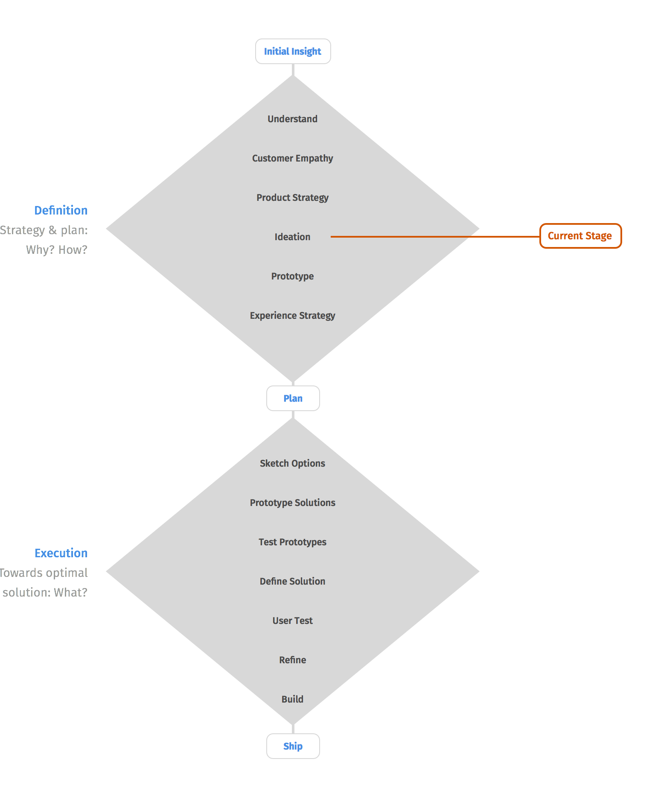
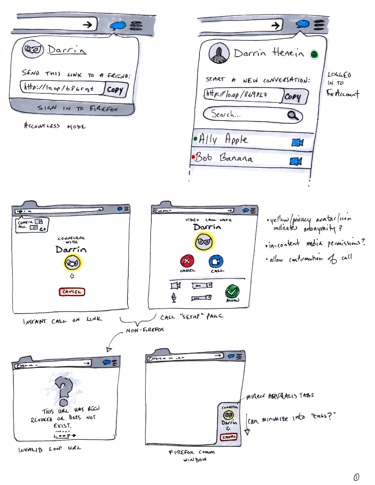
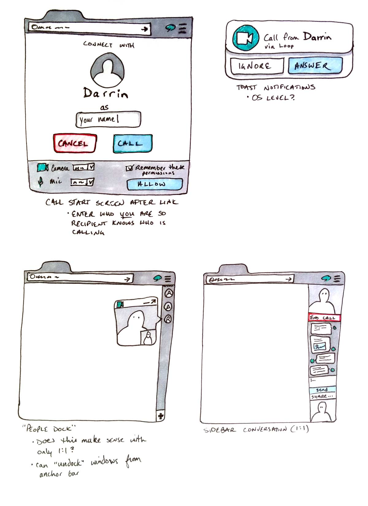
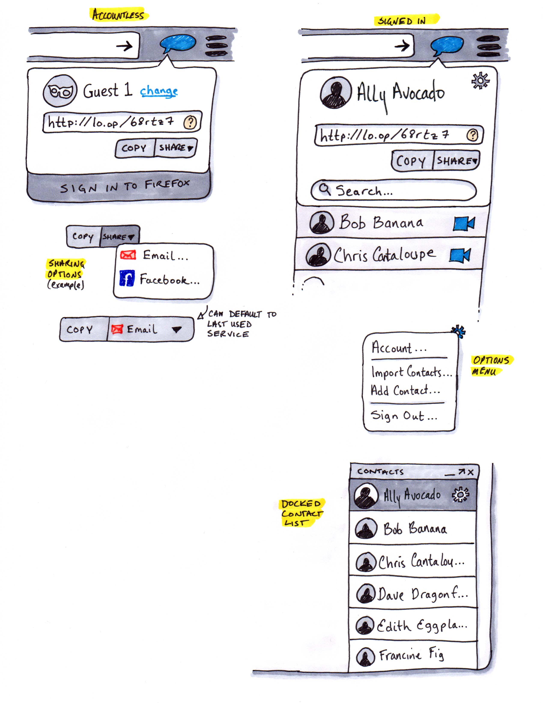
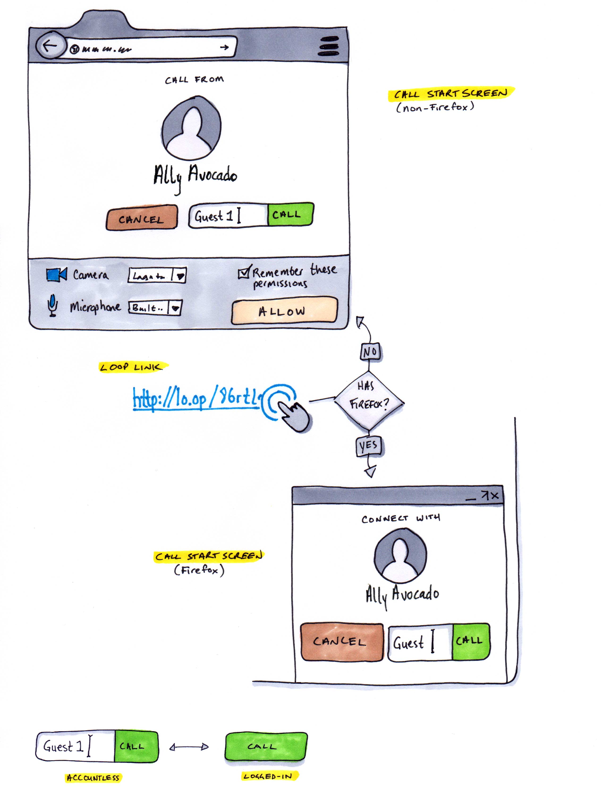
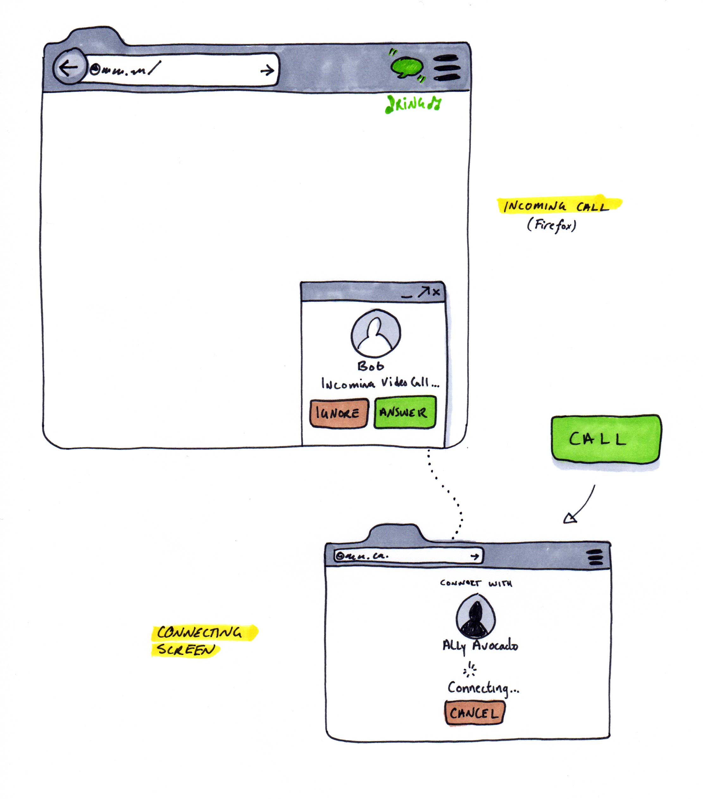
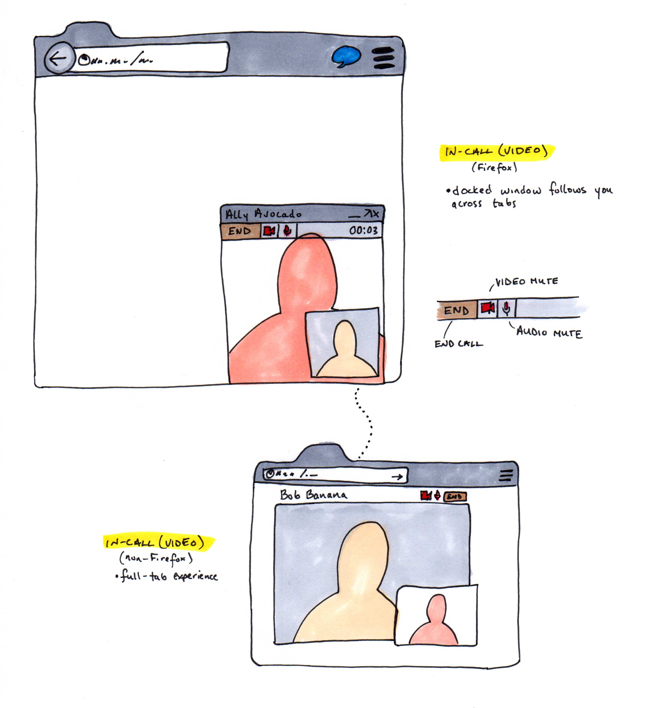
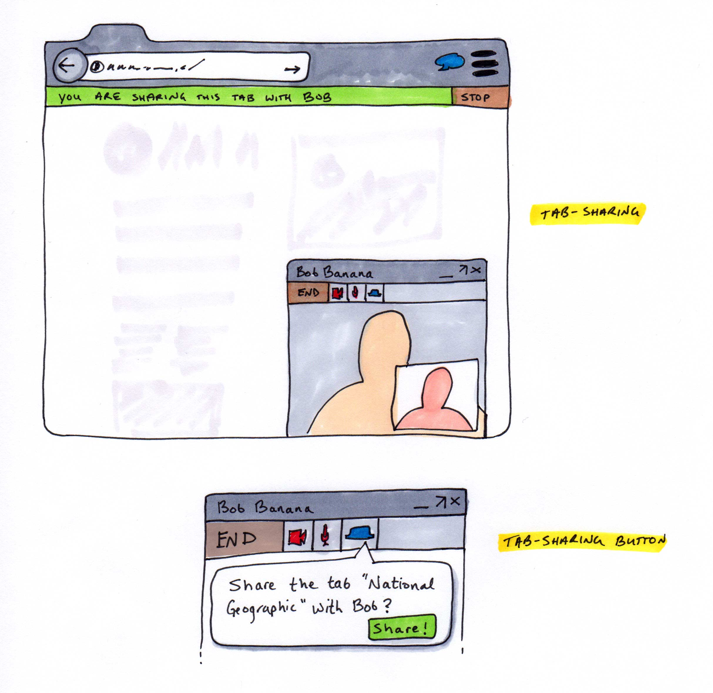
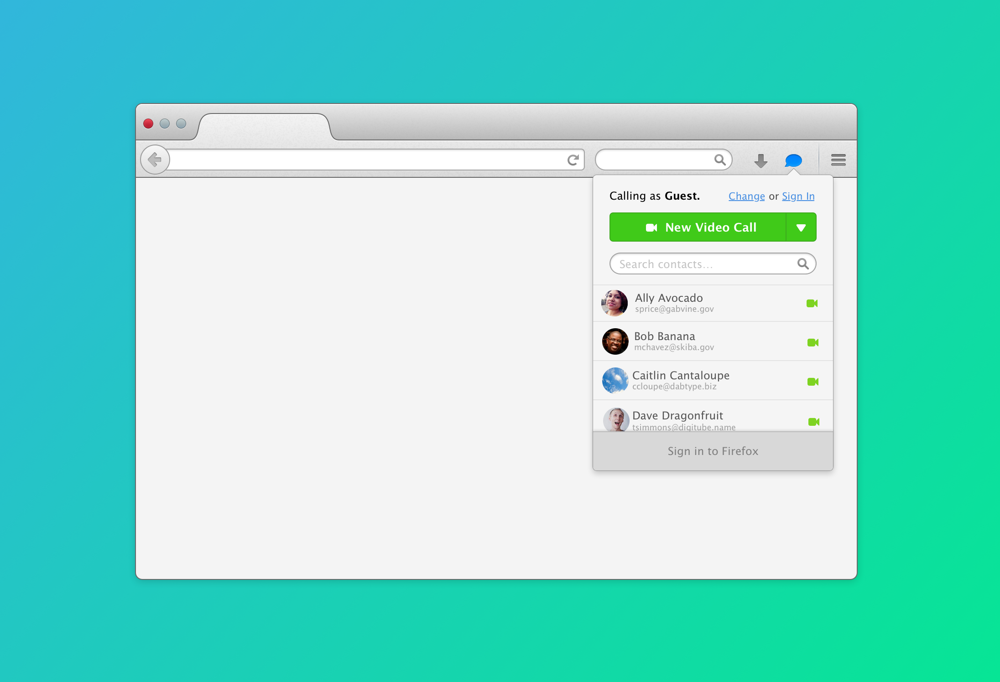

##Overview

Loop is a product that leverages WebRTC technology to allow for *instant and easy communication* across various browsers and devices. Basic usage would be anonymous and link-driven, and a **Firefox Account** (FxA) would enable a richer experience.

Beyond the initial video chat experience, this technology could enable a host of innovative communication channels, such as cross platform messaging, file-sharing, co-browsing and sharing of web experiences.

####Why Mozilla?
By building Loop, Mozilla is in a unique place to provide the product our users deserve. Loop will enable our existing Firefox desktop audience (and over time, our Firefox mobile and Firefox OS audiences) to communicate, share, collaborate and coordinate in real-time on a platform built on the open web.

---

##Process & Values

###Design Process
Below is a diagram outlining the ideal process utilized by the Firefox UX team. It involves two major phases, Definition and Execution.

**Definition** — This phase is about exploring the realm of possibility and narrowing that realm to a subset of ideas containing only acceptable solutions.

**Execution** — This phase encompasses the process of refining the subset of proposed solutions into a defined solution which is built and iterated upon until acceptance.

Note both phases begin "narrow", go "wide" and eventually return to a state of focus. This represents the (ideally) specific problem domain, the exploration of a set of possibilities, and the narrowing/refining of that set into something focused on the solution.

###Design Values

Above is a representation of the Firefox UX teams [Design Values][design-values]. Design values help us understand the attributes of _Firefoxiness_ and guide us as we work.

We believe Loop very well embodies our values, especially **Plays well with others** (you don't have to have Firefox), **Balances power and simplicity** (bringing advanced technology to a wide audience), and **Takes care of you** (protects your privacy and respects anonymity).

####User Value
These core tenets enumerate the value a product such as Mozilla Loop provides to users:

#####Immediate and Global
1. **No Download** → entirely link driven
2. **No Sign Up Required** → Anonymous by default, FxA enables more engaging features
3. **Brand Trust** → Feel secure and safe while communicating
4. **Integrated with the Browser** → Share the web you love. No uptake required by webmasters, features work on the whole web from day 1.

#####Future Prospects
- **Co-browsing** → True social browsing, sharing the same tab instance
- **File transfers** → Painless and fast file sharing on a secure, open platform
- **Open Messaging Platform** → A truly open and secure messaging platform for all your devices. No walled gardens.
- **Real-time Sharing** → Current sharing revolves around links and feeds, where sharing is asynchronous and often results in disjointed discussion. Real-time sharing empowers collaboration and conversation in a natural way.

---

##Research

###Existing Landscape

**Summary:** The majority of anonymous, web-based video chat services rely on a link-based initiation and leverage WebRTC as a communication channel. Features are largely homogeneous with small differences from product to product.

 **Product** | **Browser Support** | **Notes**
 ----------- | ------------------- | ---------
 [talky.io](http://talky.io) | Firefox, Chrome | anonymous chatting, user-defined link, lock room, multiple participants
 [hu.tt](http://hu.tt) | Firefox, Chrome | random English links, 4 participants
 [vLine](http://vline.com) | Firefox, Chrome | name yourself, max 4 participants
 [Sharefest](http://sharefest.me) | Firefox, Chrome | file sharing only
 [RTC Copy](http://rtccopy.com) | Firefox, Chrome | user-defined link, file transfer, IM
 [Appear.in](http://appear.in) | Firefox, Chrome, Opera | 8 participants, IM, kick user, lock room, 3rd party API
 [Facemeeting](http://facemeeting.com) | Firefox, Chrome | premium features, own your link, meetings calendar, IM
 [ooVoo](http://www.oovoo.com/buy.aspx) | Web, Mobile, Desktop, Facebook | free 12-way video calling, audio, IM, call recording, screen sharing

 <small>Full competitive analysis by Maria Sandberg available [here](https://docs.google.com/a/mozilla.com/spreadsheet/ccc?key=0AlJmiyFngeSwdFAtQ18wS3V2bkFFV0QyNk02dnVrV2c&usp=drive_web#gid=0).</small>

####Mental Models

Almost all of the products examined or referenced employed a mental model which fell into one of two categories: the **location** metaphor and the **conversation** metaphor. A few (generalized) key differences are enumerated below.

**Quality** | **Location** | **Conversation**
:---------|:--------------:|:-----------------:
Lifetime | permanent    | transient/ephemeral
Persistence | returnable   | expires
Visibility | open/public or locked/private | inherently private
Size | group/many | one-to-one
Initiation | async/link | ad-hoc/direct/contact list
Verb | Call-in | Call-back
_Examples_ | _'Chat Room', 'Meeting Room', 'Campfire', 'Hutt'_ | _'Phone Call', 'Chat', 'Session'_

User research showed that existing link-based services evoked a strong sense of location for the users. Participants spoke about "accessing the chat room" or "sending the link to my meeting room". Care must be taken with any link-driven architectures to not evoke a "place" for users when really they are initiating a "conversation".

Alternatively, one could be explicit by labeling it as a "private conversation room", or even a "private room".

###User Research Findings

From _Bill Selman's User Research Report on vLine_:
> "The most common challenge we identified for participants was a confusion about the functional relationship between the video link and the video conference"

> "Participants saw the value of accounts for frequent contacts or saving chat data. However, many participants also appreciated the impermanent nature of a generated link-based video conferencing service."

> "**Sharing** and **co-browsing** are important features to consider for the MLP. Integrated **text chat** was the most frequently cited missing feature from vLine." (emphasis added)

> "After connecting, almost all participants understood that the link to the video conference could be shared to connect to their currently instantiated video conference"

###Opportunities

With Firefox on desktop, the primary challenge a product such as Loop faces is the multitude of existing communication software. This is compounded by the scenarios which require a link to be sent out of band (on an existing communication channel). Many of these existing channels offer features which are comparable to some of the Loop user stories. The challenge then becomes:

- **How can we, as the browser, provide a more compelling experience than existing desktop software? Why would people choose Loop?**

Many existing communication platforms are multi-platform and leverage text, voice and video:

- **How can we leverage our existing mobile and OS products to provide a seamless communication experience?**

---

##Exploration

###Loop Core Stories

####Video Calling
Easy, instant video calling with anyone. Account-less calls are available without hassle. Signing in with a Firefox Account enables an enhanced experience, with a persistent buddy list, chat logs, etc.

The primary account-less (either or both parties are not signed-in) experience will be link driven. Users will be able to generate a Loop link that can be shared. Visiting this link will 'call' the initiating user and when accepted, a video call is initiated. One caveat is that the user is required to share the link URL via an external communication service, such as email or an existing chat service, where existing video calling features may already exist.

**Use Cases**
-   Account-less calling for everyone, no client required
 > "Just click this link to join a video call with me!"

**Similar Services**
- **Google Hangouts +** [**Chrome Extension**](https://chrome.google.com/webstore/detail/hangouts/nckgahadagoaajjgafhacjanaoiihapd)

  This add-on enables cross-tab voice, video and IM conversations to occur. Conversation windows are free-floating and movable, and snap to the edges of the window. Windows can also be moved outside of the parent browser container, and snap to the edges of the screen as well. Windows persist across tabs. The buddy list/conversation window only remains in front of Chrome when docked to the bottom edge.

  Minimizing the window at the edge of the screen displays a thin UI which indicates it's presence, which expands on hover.

  The add-on also adds a menu bar item in OSX, allowing persistent access to the buddy list. Native notifications are also used to alert the user of events if Chrome is not the active application.

  Google Hangouts also provides an API for third party developers to integrate in their apps, leading to a rich ecosystem of chat clients across desktop and mobile.

**Sketches**

---

**Loop Toolbar & Contact List**

---

**The Start Page**

---

**Making a Call**

---

**In a Video Call**

---

###Loop Conceptual Stories

These are some possible use cases for a Loop-enabled Firefox in the future.

 ####Co-browsing/Tab Sharing
 True social browsing. Share the web in real time. Co-browsing would enable two parties to share an instance of a tab, where both users would see the same rendered content and have the ability to interact with the same page.

 **Use Cases**
-   Collaboration on any type of page, not just Google Docs
  > "Give me your opinion on this website I'm building"

-   Simplify tasks that are currently clumsy or inelegant
  > "Can you read this email before I send it?"

-   Sharing content in real-time: video, audio, images
  > "Let me show you my vacation pictures and tell you about my trip!"

  > "Allow me to present the findings of my research"

-   Chatting while playing an online game
  > "Pass the ball to me!"

-   Remote interviews
  > "Let me walk you through my portfolio!"

-   Pair programming
  > "Here, let me show you how to fix that bug"

-   Remote IT support
  > "Ok, let's see what's going on with your computer..."

<small>For more in-depth examples of co-browsing, see Boriss' work on Talkilla [here][talkilla-doc].</small>

**Sketch**

---

####Simple File Sharing
Aside from Apple's Airdrop (which only works on Apple devices) and asynchronous services like Dropbox, there are still no ubiquitous, easy, secure ways to share files from various devices. Most users resort to email, or an upload service with links to share their files.

Value here would be multiplied for larger files, which currently pose the most problems when sharing (email limits, upload/download speeds, etc.)

 **Use Cases**
-   Share your stuff, quickly and easily
  > "Here are the videos from last night's event, ready for editing!"

-   Get your content where you need it
  > "Let me quickly sync this new Silverchair album to my phone for the commute home"

**Two Options**

File sharing could potentially work in both synchronous (P2P streaming of files during a call/conversation) and asynchronous (recipient is offline, give me a link to where they can access this file in the future) modes. Asynchronous mode would clearly require a (temporary) place to store the files, which opens up opportunities to allow a user choice (use my Dropbox/Google Drive/Box account for storage).

####Cross Platform Messaging
Surprisingly this is still a largely unsolved problem. Products such as iMessage work well, given the user (and their contacts) all use Apple products. Products such as Google Talk/Chat or Skype require a user to be "signed in", and often struggle with mobile continuity. Platforms such as SMS work well on mobile, but lack a compelling desktop/tablet story. Facebook's Messenger platform has come close in providing a truly robust, cross-platform solution, but is still only a feature of a much larger ecosystem.

What users deserve is an open, secure, and privacy-oriented messaging solution that is free, available on all the devices they use, and allows communication to be continuous when moving between devices.

**Similar Services**

- see **Google Hangouts** in [Video Calling](#video-calling)

**Use Cases**
-   In a multi-device world, I want my conversations to come with me
  > "Where did you send the directions? My email? Did you text it to me? Oh, thats on my work computer!"

  > "Oh you texted me earlier? Sorry, I was at my computer and didn't hear my phone buzz"

-   I want to trust the platform I communicate on
  > "Privacy is important to me, I hope Google/Apple/etc. aren't reading my messages!"

  > "How come when I'm talking to my friend in Google Chat about taxes I suddenly see a bunch of ads about Tax Software?"

-   Open API and web-based
  > "When I launch my new AR enabled sunglasses [insert new hardware/OS here], I can rest assured that my customers will have access to their Loop messages"

**Similar Services**
- [Viber](http://www.viber.com) - Free, cross-platform messaging and calling

___
###Foundations
This is a list of potentially abstract concepts that will anchor the **[Core](#loop-core-stories)** and **[Conceptual](#loop-conceptual-stories)** stories to the browser.

####The Menu Item
This icon would open a panel which would enable the initiation of most Loop activities, such as obtaining a callback link for a video chat or chatting with someone from your buddy list.

####The Anchor Bar
The exact manifestation of this UI is important but not yet determined. When one considers communicating with multiple users simultaneously (video, chat, etc) some method of switching conversations will be required. Also, this may help differentiate anchored UI (a video window, for example) as part of the Firefox UI as opposed to being part of the website/current tab.

####Comm Windows
Whether audio, video, file transfers, or text chatting, communication channels should share a common appearance to leverage enforce unity and provide a consistent experience regardless of channel. These should be anchor-able, collapsible (minimized in the Anchor Bar), and detachable (floated as separate OS level windows).

####Notifications
Various events coming from Loop will require immediate user action be taken, such as an incoming call request. Loop should be able to alert the user in 2 scenarios: when Firefox is the user's current active window and when the user has minimized or de-focused Firefox (i.e. they are doing something else).

It is likely worth considering what the 'outside the browser' experience looks like. Possible OS-level integrations include:

-  a separate, badge-able, dock-able app icon
-  a menu bar item

##MVP

####Pre-Call

1. Auto sign-in with existing Firefox Account
2. Buttons to sign in, sign up and sign out (as appropriate)
3. Can be reached by my signed in Firefox Account email address
4. Can be reached when signed out by my Loop browser ID

####User Management

1. Can import Google contacts
2. Can add, edit and delete existing or new contacts (name, email, picture?)
3. Can view and search/filter list of contacts in Loop UI
4. Can view and clear incoming and outgoing call history

####Calling

1. Can make a video or audio-only call to a Firefox Account contact
2. Outgoing calls should ring if called contact is available, otherwise indicate unavailability (offline, busy signal, refused, etc.)
3. Can cancel the outgoing call before a connection is made
3. Can generate and copy a callback URL on demand, or when calling a non-Firefox Account contact
4. Can prepopulate an email in default composer to be shared with callback URL

####Receiving

1. Can be notified of incoming calls
2. Can see who is calling me (if available)
3. Can answer an incoming call with video or audio-only
4. Can decline/ignore the call
5. Can acceept+revoke or decline+revoke a URL based call

####In Call

1. Can mute/unmute my microphone
2. Can show/hide my video stream (in video call)
3. Can hang-up
4. Can switch to full-screen mode with the same mic/camera controls
5. Can pop-out the docked window into its own window
6. Get notified when other party terminates the call or the connecgtion is lost

####Privacy & Permissions

1. When signed in, I can manage who can call me (anyone or contacts-only)
2. I can tell Firefox to 'remember' my camera/mic permissions for both incoming/outgoing calls
3. I can control how long a generated link should be active, with a default expiry time

####Feedback & Measurement

1. Get prompted for feedback after a call with a short survey

<!-- links -->
[design-values]: https://people.mozilla.org/~dhenein/labs/design-values/ "Design Values"
[talkilla-doc]: https://docs.google.com/document/d/117UiIH9FYhDLg-r9dcLtYPKurNXDZ-1yCI7Saj0BMEI/edit?pli=1#heading=h.xxhmhowcmoy "Talkilla Google doc"