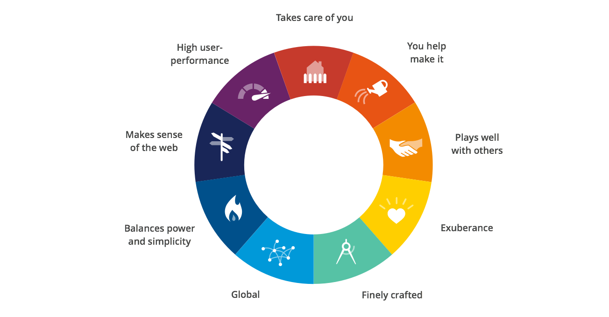

## Overview

This is a template for creating beautiful docs, easily.

#### Why Mozilla Docs?

Because it's awesome, that's why.

---

### Design Values

Above is a representation of the Firefox UX teams [Design Values][design-values].
Design values help us understand the attributes of _Firefoxiness_ and guide us
as we work.

[design-values]:https://people.mozilla.org/~dhenein/labs/design-values/
